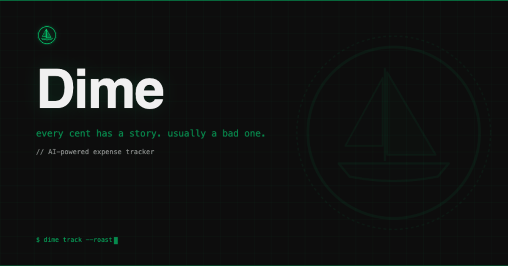

# Dime

Every cent has a story. Usually a bad one.



Dime is an AI-powered expense tracker that parses natural language, categorizes your spending, and roasts you in Hinglish for your life choices. Type "coffee $5" and watch Gemini judge you in real time.

**Live:** [dime.tgoyal.me](https://dime.tgoyal.me)

---

## Backstory

Dime is a ground-up rewrite of [WalletRIP](https://github.com/tejalgoyal2/WalletRIP) — my first expense tracker that worked but had... issues. Client-side database writes, no rate limiting, `any` types everywhere, the kind of security that makes you wince when you look back at it. It was also on Vercel, which had its own [security incident](https://vercel.com/blog/postmortem-on-incident-affecting-vercel-logdrains) that made me rethink hosting decisions.

So Dime happened. Same core idea (type naturally, AI handles the rest), but rebuilt from scratch: proper server-side API routes, Zod validation, Upstash rate limiting, Cloudflare Workers, a design that doesn't look like a Bootstrap template, and a Quick Add API so I can log expenses through Siri without opening the app.

---

## What It Does

- **Natural language input** — "uber to work $12" just works. No dropdowns, no forms, no pain.
- **Gemini-powered parsing** — Categorizes, assigns emojis, figures out Need vs Want (spoiler: it's usually a Want).
- **Hinglish roasts** — Because guilt should at least be funny.
- **Spending charts** — Needs vs Wants donut + weekly/monthly trends.
- **AI insights** — 30-day spending analysis that notices patterns you'd rather ignore.
- **Subscription hunter** — Finds recurring charges hiding in your expenses.
- **Quick Add API** — Log via Apple Shortcuts, Siri, curl, Raycast — anything that sends HTTP.
- **Bulk import** — Paste a bank statement, Gemini parses the whole thing.
- **CSV export** — Injection-safe, because we're not animals.
- **Streak tracking** — Gamification for responsible adults.
- **Dark/light theme** — Neon Midnight by default. Light mode if you must.

---

## Tech Stack

| Layer | Choice |
|-------|--------|
| Framework | Next.js 16 (App Router, TypeScript strict) |
| Runtime | Cloudflare Workers via @opennextjs/cloudflare |
| Database + Auth | Supabase (PostgreSQL + RLS) |
| AI | Google Gemini 2.5 Flash-Lite |
| Rate Limiting | Upstash Redis (sliding window) |
| Styling | Tailwind v4 + CSS custom properties |
| Animations | Framer Motion |
| Charts | Recharts |
| CI/CD | GitHub Actions → Cloudflare Workers |

---

## Getting Started

```bash
git clone https://github.com/tejalgoyal2/Dime.git && cd Dime
npm install
cp .env.example .env.local
# Fill in your keys — see .env.example for what's needed
npm run dev
```

All required environment variables are documented in `.env.example` with descriptions.

---

## Quick Add API

Log expenses without opening the app. The laziest possible way to be financially responsible.

```bash
curl -X POST https://dime.tgoyal.me/api/quick-add \
  -H "Authorization: Bearer YOUR_TOKEN" \
  -H "Content-Type: application/json" \
  -d '{"text": "coffee at starbucks $5.50"}'
```

Returns:
```json
{
  "success": true,
  "expense": {
    "item_name": "Coffee at Starbucks",
    "amount": 5.50,
    "category": "Food & Drink",
    "type": "Want",
    "emoji": "☕"
  }
}
```

### Apple Shortcuts / Siri Setup

1. Open **Shortcuts** on your iPhone
2. Create a new shortcut
3. **Ask for Input** — Type: Text, Prompt: "What did you spend?"
4. **Get Contents of URL:**
   - URL: `https://dime.tgoyal.me/api/quick-add`
   - Method: POST
   - Headers: `Authorization: Bearer YOUR_TOKEN`
   - Body: JSON → `{"text": "[input from step 3]"}`
5. Optional: **Show Notification** with the result
6. Name it "Log Expense"

Now "Hey Siri, log expense" works. Also works with Raycast scripts, iOS Automations, or literally anything that can send a POST request.

---

## Deployment

Push to `main` → GitHub Actions → Cloudflare Workers. Automatic.

```bash
# Or deploy manually
npm run deploy
```

---

## Project Structure

```
app/
  api/           Server API routes (expenses CRUD, parse, insights, roast, quick-add)
  login/         Callsign auth + invite code
  page.tsx       Auth gate → dashboard
components/
  dashboard/     Form, table, charts, roast, subscriptions, bulk import
  providers/     React Context (expenses, theme, toasts)
  ui/            Primitives (button, modal, skeleton, error boundary)
  auth/          Sign-out, login form
lib/
  supabase/      DB clients, middleware, types
  schemas/       Zod v4 validation
  gemini.ts      AI config
  rate-limit.ts  Upstash (lazy init for Workers compat)
```

All mutations go through server API routes. The client never writes to the database directly — a lesson learned from WalletRIP.

---

## Design

**Neon Midnight** — dark-first, electric green accent, Syne + JetBrains Mono. Feels like your terminal at 2am except it's tracking how much you spent on bubble tea this week.

Light mode available for people who work near windows.

---

## What's Next

Some things that could happen if motivation strikes:

- **Edit expenses** — PATCH endpoint exists, just needs a UI
- **Budget goals** — Set limits, get warned when you're close (or past)
- **Multi-currency** — For when "coffee $5" becomes "koffie €4"
- **Recurring expense tracking** — The `is_recurring` field is ready, just needs a brain
- **Better mobile charts** — Touch-friendly tooltips
- **Expense categories breakdown** — Beyond just Needs vs Wants
- **Shared expenses** — Split tracking with friends (and the inevitable "you still owe me")

---

## Scripts

| Command | What |
|---------|------|
| `npm run dev` | Dev server (Turbopack) |
| `npm run build` | Production build |
| `npm run build:cf` | Build for Cloudflare Workers |
| `npm run preview` | Preview Workers build locally |
| `npm run deploy` | Build + deploy to Cloudflare |

---

Built by [Tejal Goyal](https://tgoyal.me)
